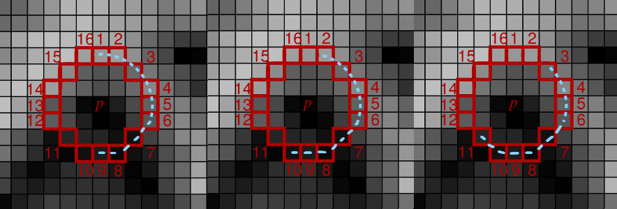

# ORB detector

In this repository you can find the implementation of part of the **ORB** (Oriented FAST and Rotated BRIEF) pipeline. The ORB consists of the feature detector and feature descriptor that detect and describe reproducible and discriminative regions in an image. Those, in turn, can be matched between pairs of images for correspondence search, 3D reconstruction, and so on.

## Given task

### Step 1
In the ORB pipeline, the keypoints detector is an improved version of the **FAST** detector. FAST keypoints detector is based on a straightforward idea. In FAST, each pixel of an image is compared with other pixels at a Bresenham circle taken around it. Usually, a circle of radius 3 is used, meaning comparing each pixel with 16 others, as shown in the image below (***left***). If the center pixel is either darker than $N$ its neighbors **or** lighter than $N$ its neighbors, it is considered an interesting point and is added to the list of initial keypoints. A threshold $t$ is used for additional robustness, i.e., a center pixel should be either darker than $I_i - t$ or lighter than $I_i + t$ (for $i\in\{1,16\}$ where $I_i$ is the intensity of $i$-th point on the Bresenham circle).

*Notice: You cannot use np.abs(center_pixel - $I_i$) < $t$*; you must take the sign of intensity distance into account.

 
<i><b>Left</b>: rotated FAST keypoints detector. <b>Right</b>: oriented BRIEF keypoints descriptor.</i>

We will start by implementing the basic version of the FAST keypoints detector. Implement the `detect_keypoints()` function. You will find helper testing code in `orb.ipynb` and some testing images in the `test_images` folder.

*Hint: prepare some small (e.g., max 64×64 px) testing images for yourself.*

To speed up the keypoint detection, FAST performs intensity checks in two steps: first, it compares the center pixel only to circle pixels at positions 1, 5, 9, and 13 (`FAST_FIRST_TEST_INDICES`). Then, if at least **3** (`FAST_FIRST_TEST_THRESHOLD`) circle pixels pass the intensity check, perform the check on all the pixels in the circle. At least **12** (`FAST_SECOND_TEST_THRESHOLD`) should now pass the test. Use `FAST_ROW_OFFSETS` and `FAST_COL_OFFSETS` to efficiently compute the coordinates of the circle pixels for each tested pixel. Feel free to precompute other indexes or masks if you find them useful.

*Hint: do not test pixels whose index are closer than `FAST_CIRCLE_RADIUS` to the image border. In the provided template, there is also the parameter `border`, which means how many rows/columns are at the image border where no keypoints should be reported.*

 
<i>In the first step, test the center pixel only against pixels 1, 5, 9, and 13, marked in yellow. Then, if the first test passes, test the center pixel against all 16 pixels on the circle.</i>

*Hint: You can split a `detect_keypoints()` implementation into three steps: In `get_first_test_mask()`, you can create a mask of the original image where each pixel contains `True` if a given pixel passes the first 4-point check otherwise `False`. Next, in `get_second_test_mask()`, you can flag pixels that did not pass the full circle test with False. In the final step, you use these masks to detect key points. **However, both `get_first_test_mask()` and `get_second_test_mask()` are not undergoing tests so you can implement `detect_keypoints()` without them in your way.***

### Step 2
Following the OpenCV's implementation, for each keypoint, we also compute a score as a *maximum of minimum abs-differences* between the center pixels and all consecutive groups of 9 pixels on the Bresenham circle. For this, implement `calculate_kp_scores()` and call it from `detect_keypoints()` to get a score for all points in the initial FAST keypoints list (i.e., to `keypoints` variable).

 
<i><b>Left</b>: example image. <b>Right</b>: taking 9 consecutive pixels on a circle for the min abs-difference computation.</i>

For each added keypoint, compare it to all groups of 9 consecutive pixels on the circle (you will have 16 groups like this, each starting from a different pixel on the circle). Calculate the minimum of absolute differences between the center keypoints and those 9 pixels. Report the final keypoint score as a maximum of those minimums from all 16 groups.

*Hint: `np.roll()` In case you use `np.roll` for 2d shifts, better use argument `axis=(0,1)`.*

 
<i>Example of three groups of 9 consecutive pixels. You have to take all 16 such groups and, for each group, calculate the minimum of the absolute differences. The final score is the maximum of those minimums.</i>

### Step 3
In ORB, this FAST keypoint detection is performed in multiple levels of an image pyramid to detect multi-scale keypoints appropriately. Implement the `create_pyramid()` function, which takes an image `img` and downscales it by `downscale_factor`  `n_pyr_layer` times. On the first level is the original image, then downscaled are the following.

*Hint: `cv2.resize()`, be careful, `cv2.resize()`  expects switched X and Y coordinates than NumPy. The size of each level should be calculated as a float but rounded up.*

### Step 4
ORB comes with further improvements to the FAST keypoints detector. For example, it is noted that FAST can detect too many edges, which do not provide as good interest points as actual corners. To deal with it, the Harris corner measure is computed for each interest point detected in the previous step. The keypoints from the previous step are then sorted by the resulting corner measure. The top-$N_{max}$ keypoints are kept for each level where $N_{max}$ can be (and, in our implementation, will be) different for each level of the image pyramid.

Harris corner measure is a simple way to evaluate the "cornerness" of a pixel and is computed as:

$$R = det(A) - k*trace^2(A)$$

- [Determinant of a matrix](https://en.wikipedia.org/wiki/Determinant)
- [Trace of a matrix](https://en.wikipedia.org/wiki/Trace_(linear_algebra))

Where $k$ is a constant usually equal to 0.05, and $A$ is the second-moment matrix for the given image (also called a structure tensor), defined as follows:

While the equation may seem confusing, you can calculate the second-moment matrix in several simple steps:s

* Implement `get_x_derivative()` and `get_y_derivative()` to compute the x and y derivatives of the input image. The easiest way to do it is by applying the Sobel operator. Similar to the Gaussian filter, Sobel is a separable filter.

*Hint: both these functions can be implemented in two lines each **without** usage of functions such as `np.convolve`, `scipy.signal.convolve2d`, and so on. Simple mathematical operations with `NumPy` are enough (+, -, and \*). Also, consider using `.astype(...)` to avoid numerical errors during your calculations and `np.pad()` to keep the original image dimension.*

*Hint 2: `scipy.signal.convolve2d` preserves dimension with parameter `mode='same'`, but the values in the first and last row/column differ from those expected here. These rows/columns should be filled by zeros if you use `scipy.signal.convolve2d`.*

*Hint 3: You can utilize your convolution implementation from the second homework.*

* Now, implement `get_harris_response()` to compute the Harris response for each pixel. First, calculate the weighted elements of the second-moment matrix. First, use `get_x_derivative()` and `get_y_derivative()` to get the first-order derivatives `dx` and `dy`. Then, you want to get $I_x^2$ (i.e. `dx*dx`), $I_x I_y$ (i.e. `dx*dy`), and $I_y^2$ (i.e. `dy*dy`) at each pixel. Then, for each pixel, the window function is applied, and the values in the window are summed with the corresponding weight ($w[r]$ in the formula above). In our implementation, we will use Gaussian window, which means just applying the Gaussian 2D smoothing (with $\sigma=1.0$) on all three matrices $I_x^2$, $I_x I_y$ and $I_y^2$. It can be done by `apply_gaussian_2d()` function that is provided to you in `utils.py`. Then, compute the response $R$ from the determinant and trace the resulting second-moment matrix $A$ as `R = det(A) - 0.05 * (trace(A) ** 2)`.

*Hint: Do not use `np.linalg.det()`; you have a matrix of shape (2, 2) (for each point of the input image); compute it manually for all points at once.

* Finally, implement `filter_keypoints()` to sort the previously-computed interest points by their corresponding Harris response. For each level $i$, leave only top-$N_{max_i}$ keypoints.

